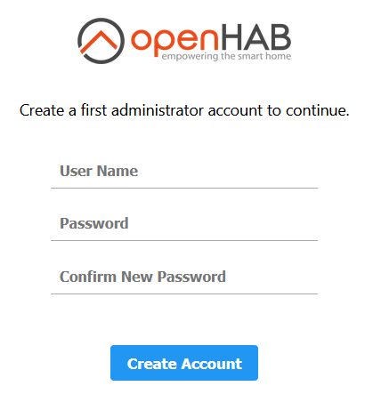
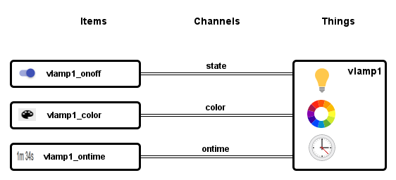
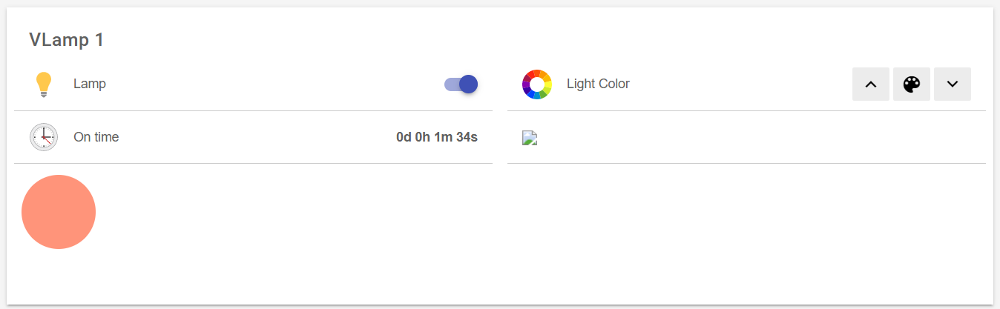

<!--- Jürgen Weber, weberjn 2021-03-24 --->

# An OpenHAB Tryout Tutorial - Using The GUI

## Login to the Browser GUI

Go to `http://mymachine:8080`

The gui prompts to create a user login. This will be your admin login.

Skip the setup for now.

## Create a Thing

First we have to chose a Binding, then create the Thing.

##### Go to Administration -> Settings -> Things

###### The page changes to Things.

Click the blue plus square right below. **(+)**

###### The page changes to Choose Binding.

We tell the system what kind of device it should create. A Binding is a driver for a kind of device. Instead of a driver for a graphics card, we need a driver for a VThing.

Click the "VThing Binding" line.

###### The page changes to Add a new Thing: vthing

Click the "VLamp" line.

###### The page changes to New VLamp

Replace the suggested Unique ID with `vlamp1`.

Label it `VLamp1`.

Click `Create Thing`.

###### The page changes to Things.

You should see a line with your VLamp1.

## Things - Channels - Items

A Thing (device) has attributes, e.g. on/off state, color or any other attribute of a physical device.

Attributes get accessed by a connection to the attribute. The connections are called Channels in OpenHAB. Data flows between the OpenHAB System and the Things through Channels.

Our virtual lamp has three attributes: 

* state
* color
* ontime 

with types Switch, Color and String. These are types as in a programming language. Possible values for Switch are ON and OFF, for Color Hue tuples.

To use the Things, we need the other end to the Channels. These ends are called Items. Page definitions and rules work with Items.

We create the Items from within our Thing, starting from its Channels.

## Create an Item for each Channel

We'll need all three Channels, so we create three Items.

##### Go to Administration -> Settings -> Things.

Select our VLamp1. 	

In the red top lines click on `Channels`.

###### The page displays the Channels of VLamp1.

Click on the state(Switch) line.

An Add Link to Item.. line appears. Click it.

###### The page changes to Link Channel to Item.

We have no Items yet, so click on the Create a new Item line.

A property sheet for the Item opens.

Enter:

Name: `vlamp1_onoff`

Label: `VLamp1 State`

The system knows from the Thing definition, what type the Channel is. So in the right appears type `Switch`. To change it, we'd click on it, but we leave it at `Switch`.

Category is for selecting an icon. 

In the Category line click on the template text `temperature, firstfloor..` and start typing: `lig`. Several suggestions matching the substring will pop up. Select lightbulb.
A lightbulb icon will appear. 

Leave the rest at the defaults.

We're done. Click on `Link` the Item to the Channel.

###### The page goes back to the Channels overview.

Our Item `VLamp1 State` appears on an extra line, now. Click it. 

###### The page changes to VLamp1 State.

The switch is already active. Click it. It changes to on. 

In openhab.log you should see a line like

    2021-03-24 21:26:55.983 [INFO ] [.openhab.binding.vthing.VLampHandler] - State: OnOffType: ON

Click `Cancel` to go back to the Channels overview.

Repeat for the two remaining Channels and create Items:

Name: `vlamp1_color`

Label: `VLamp1 Color`

Type: Color

Category: ColorLight

and

Name: `vlamp1_ontime`

Label: `VLamp1 Ontime`

Type: String

Category: time

When your done, you should see on the Channels overview that the ontime Item counts up. You might have to click the down arrow on the right.

On the top right click `Save (Ctrl-S)`

## List the Items

Now, that we've created the Items, we can list them at

##### Administration -> Settings -> Items

## Create a Page

Now we can create a page containing our Items. The page is the user interface for our Thing. 

##### Go to Administration -> Settings -> Pages

Click the blue plus square right below. **(+)**

Create Sitemap.

###### The page changes to Create sitemap.

Click the `New Sitemap` line.

On the right sheet for the page properties appears.

Enter:

ID: `vthings`

Label: `Virtual Things Test OpenHAB`

The page will contain a Frame, that contains a heading and blocks to display our items and therefore the vlamp1 Thing's attributes.

Click `Insert Widget Inside Sitemap`

A popup with widgets will appear. Select `Frame`.

We have now

    Sitemap
    - Frame

Frame should be selected.

Click `Insert Widget Inside Frame`

Select `Switch`.

Fill its properties:

    Label: Lamp

Click the Item Line and select `VLamp1 State (vlamp1_onoff)`

Click behind Icon and type `lig` and choose lightbulb.

We have now

    Sitemap
    - Frame
    -- Lamp

_Select Frame again_

Repeat adding Widgets to the Frame for

Colorpicker

with 

    Label: Light Color 
    Item: vlamp1_color
    Icon: colorwheel

and Text

    Label: On time [%s]
    Item: vlamp1_ontime
    Icon: colorwheel

and finally

Webview

    URL: /vlamp/lampcolor.html?thingUID=vthing:vlamp:vlamp1

We have now

    Sitemap
    - Frame
    -- Lamp
    -- Light Color 
    -- On time
    -- Webview

On the top right click `Save (Ctrl-S)`

## View the page

Click the openHAB Logo top left.

###### The page changes to Overview (not yet configured)

Quite at the right you should see a little icon

On click there appear previews of Basic UI and HABPanel. Click on Basic UI.

Click on Available sitemaps `Uicomponents_vthings`.

###### you should see

Switch the lamp with the blue switch. Same with the app and down arrows at the right top area. 

Click the palette icon and play with the color settings. 

