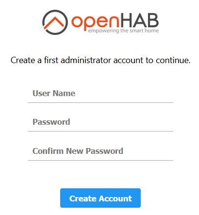
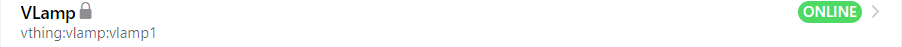
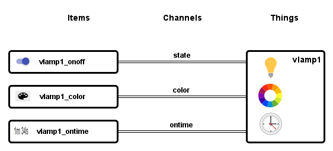

<!--- Jürgen Weber, weberjn 2021-03-20 --->

# An openHAB Tryout Tutorial

openHAB is a server software to manage home automation devices, called Things in home automation speak. Each kind of device needs a device driver called Binding.

This tutorial uses the Virtual Thing to get you up and running quick without needing a real hardware Thing. The Virtual Thing pretends to be a lamp. The Virtual Thing must have a Virtual Thing Binding to work.

## Install openHAB

Use a Unix or Windows computer that has Java 11 installed. 

    ~ $ java -version

should answer with version 11.

Unzip the openHAB distribution zip into a folder.

    ~ $ unzip -d openhab-3.0 openhab-3.0.1.zip
   
Start the openHAB server:

```shell
~/openhab-3.0 $ ./start.sh
Launching the openHAB runtime...

                           _   _     _     ____
   ___   ___   ___   ___  | | | |   / \   | __ )
  / _ \ / _ \ / _ \ / _ \ | |_| |  / _ \  |  _ \
 | (_) | (_) |  __/| | | ||  _  | / ___ \ | |_) )
  \___/|  __/ \___/|_| |_||_| |_|/_/   \_\|____/
       |_|       3.0.1 - Release Build

Use '<tab>' for a list of available commands
and '[cmd] --help' for help on a specific command.
To exit, use '<ctrl-d>' or 'logout'.

openhab>
```

When you see the friendly prompt, the server is up and running.

### Port busy?

Check the openhab.log for lines like

    Caused by: java.net.BindException: Address already in use

If you get an Exception that the port is busy, [see here](openhab-listenport.md) about how to change openHAB's listen ports.

# Text or GUI?

You can define openHAB's home automation in textual config files or via the web gui. Unix people will prefer Configuration as Code, so we'll do textual config, here. If you prefer the GUI, follow the Gui guide [openhab-tryout-guide-gui.md](openhab-tryout-guide-gui.md).

## Setup a Thing Binding

To install a Thing Binding, we've got to shut down the server again. 

Press ^D in the prompt and wait for the shell prompt to appear. It takes some 20 seconds for the server to shut down, be patient.

Download the VThing Binding from [org.openhab.binding.vthing-3.1.0-SNAPSHOT.jar](https://github.com/weberjn/openhab-tryout-guide/releases/download/1.0.0-SNAPSHOT/org.openhab.binding.vthing-3.1.0-SNAPSHOT.jar) and copy it into the addons directory: ` ~/openhab-3.0/addons/`

Use your favorite editor and change

    ~/openhab-3.0 $ vi conf/services/addons.cfg
    
look for a `binding=` line, if it is not there, add it:

    binding = vthing,astro,mqtt,exec,mail
   
We add Bindings (device drivers) for vthing and other goodies. Software devices (Things) like mqtt or mail also need a device driver (Binding).

Start the server again. openHAB will download the Bindings from the web.

Open a second shell and tail the server log:

    ~/openhab-3.0 $ tail -F userdata/logs/openhab.log


## Setup a Thing

Open a third shell and create a definition file for our virtual lamp:

    ~/openhab-3.0 $ vi conf/things/vlamp.things
    
add a line

    Thing vthing:vlamp:vlamp1
    
Go to the server shell and type 

    openhab:things list
    
and you should see    

    vthing:vlamp:vlamp1 (Type=Thing, Status=ONLINE, Label=VLamp, Bridge=null)
    
If not, try again in a few seconds.    
    
We have installed an instance of a Thing (device). This is a Virtual Thing, so there is no hardware device connected with it.

## Have A Look with the Web Browser

Go to `http://mymachine:8080`

The gui prompts to create a user login. This will be your admin login.



Skip the setup for now.

##### Go to Administration -> Settings -> Things

You should see the vlamp1 we defined in `vlamp.things`.



The Thing is locked and cannot be changed in the Gui, because it was defined in a text file.

A Thing (device) has attributes, e.g. on/off state, color or any other attribute of a physical device.

Attributes get accessed by a connection to the attribute. The connections are called Channels in openHAB. Data flows between the openHAB Server and the Things through Channels.

Our virtual lamp has three attributes: 

* state
* color
* ontime 

with types Switch, Color and String. These are types as in a programming language. Possible values for Switch are ON and OFF, for Color Hue tuples.

To use the Things, we need the other end to the Channels. These ends are called Items. Page definitions and rules work with Items.



## Setup Items

In the shell create a definition file for our virtual lamp items:

    ~/openhab-3.0 $ vi conf/items/vlamp.items
    
with content

    Switch vlamp1_onoff  {channel="vthing:vlamp:vlamp1:state"}
    Color  vlamp1_color  {channel="vthing:vlamp:vlamp1:color"}
    String vlamp1_ontime {channel="vthing:vlamp:vlamp1:ontime"}
    
Go to the server shell and type 

    openhab:items list
    
and you should see    

    vlamp1_onoff (Type=SwitchItem, State=ON, Label=null, Category=null)
    vlamp1_color (Type=ColorItem, State=2,57,100, Label=null, Category=null)
    vlamp1_ontime (Type=StringItem, State=, Label=null, Category=null)

## Look at the items in the Browser

##### Go to Administration -> Settings -> Items

The three items should appear here.

Click on the vlamp1_onoff line, the gui switches to detail view.

Click on the switch in the first white box. The switch goes on. 

In the server log you should see an info entry.

    2021-03-20 11:14:29.991 [INFO ] [.openhab.binding.vthing.VLampHandler] - State: OnOffType: ON

In the browser, click back and have a look at the ontime Channel. The details view should show how the on time of the lamp goes up.

Leave the switch on for now.

## Create a page for the items

To view the items in a nice browser view or the Android app we need to create a page definition containing the items.

In the shell create a definition file for our virtual lamp page:

    ~/openhab-3.0 $ vi conf/sitemaps/vthing.sitemap
    
with content

```json
sitemap vthings label="Virtual Things Test openHAB" {
  Frame {
        Text item=vlamp1_onoff label="VLamps"  {
            Frame label="VLamp 1" {
                Switch item=vlamp1_onoff label="Lamp" icon="lightbulb"
                Colorpicker item=vlamp1_color label="Light Color" icon="colorwheel"
                Text item=vlamp1_ontime label="On time [%s]" icon="time"
                Webview url="/vlamp/lampcolor.html?thingUID=vthing:vlamp:vlamp1"
            }
        }
    }
}
```
    
## Look at the items page in the Browser

Click at the openHAB logo upper left to go to the Overview page. 

Quite at the right you should see a little icon


On click there appear previews of Basic UI and HABPanel. Click on Basic UI.

Click on Available sitemaps vthings.

Click on > and you should see


Switch the lamp with the blue switch. Same with the app and down arrows at the right top area. 

Click the palette icon and play with the color settings. 

## How does it work?

In the page definition there are references to items like `item=vlamp1_onoff`. The item is defined in `vlamp.items`. There it is linked to a Channel definition specified by the Thing ID (channel="vthing:vlamp:vlamp1:state) and the Channel ID (state): `Switch vlamp1_onoff  {channel="vthing:vlamp:vlamp1:state"}`

So, when you click on the switch in the gui, the system knows that it is linked to a given Channel of a specific Thing. The Switch generates a Command like "ON" and the system forwards it to the state Channel of the virtual lamp. For the uptime, data flows from the Thing to the gui.


